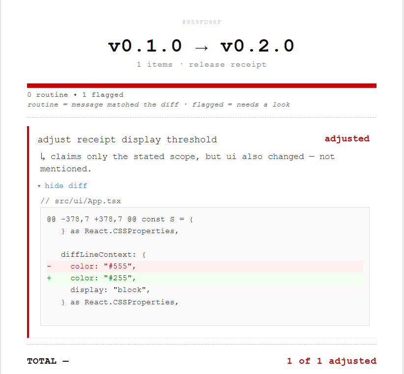

# FinePrint

Checks whether a release's commit messages actually match what the code changed.

Existing changelog tools (GitHub auto-notes, Release Drafter, semantic-release) summarize what commit messages say. None of them check whether those messages are telling the truth. FinePrint reads the real diff between two release tags and verifies each commit's message against what actually happened in the code.

## How it works

1. Paste a public GitHub repo URL and pick two tags to compare.
2. FinePrint fetches every commit between those tags, along with its full diff, using GitHub's public REST API.
3. Each commit runs through three independent checks:
   - **Diff-vs-message mismatch** — extracts the areas of the codebase a commit's message claims to touch, compares that against which areas actually changed in the diff, and flags anything that changed but was never mentioned.
   - **Semver violation** — checks whether a patch or minor version bump secretly contains a breaking change (e.g. a removed export or changed function signature).
   - **Dependency bump** — flags any dependency manifest change with a major-version jump, regardless of what the commit message says.
4. Auto-generated, mechanical commits (release-plugin bumps, merge commits) are excluded automatically, so they never create false noise.
5. Results render as a single itemized "receipt": a health bar shows routine vs. flagged commits at a glance, flagged items show a plain-English reason, and tapping any flagged item reveals the actual code diff as evidence — nothing is asserted without proof.

All analysis is rule-based and runs entirely in the browser — no live AI call at runtime, no backend, no account, no secrets. This keeps results fast, reproducible, and reliable for every user.

## Live Demo
**Live app:** [https://zesty-dasik-312180.netlify.app/]

## Built with IBM Bob 2.0
Built using Bob's Agent mode with full document understanding of the codebase. The three checks above were built as three parallel subagents — spawned simultaneously, each independently implemented and tested, then merged into a single verdict engine. Iterative hardening (real-data testing, UX fixes, performance tuning) was done across further Agent-mode tasks. See `bob_sessions/` for task-by-task evidence.

## Tech Stack
React, TypeScript, Vite, GitHub REST API. No backend, no database — a static, zero-install web app.

## Validation
Tested against real repositories: correctly flagged a deliberately undisclosed change in this project's own test commits, and ran cleanly against `FasterXML/jackson-databind` and `facebook/react` with zero false positives on genuine, honestly-labeled commits.

## License
No license specified — submitted for the IBM Bob 2.0 Hackathon.